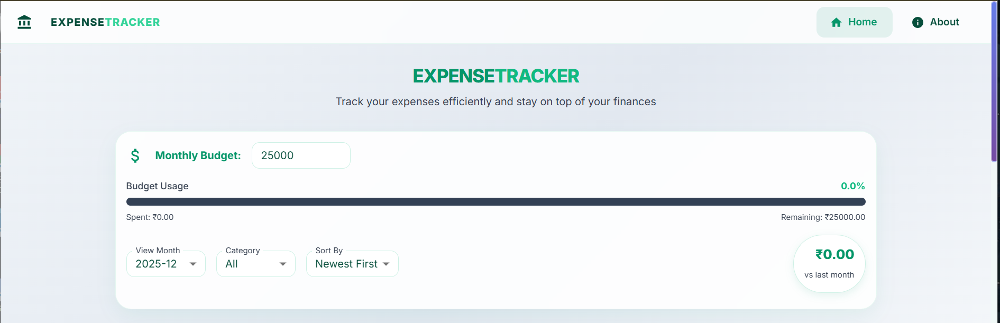
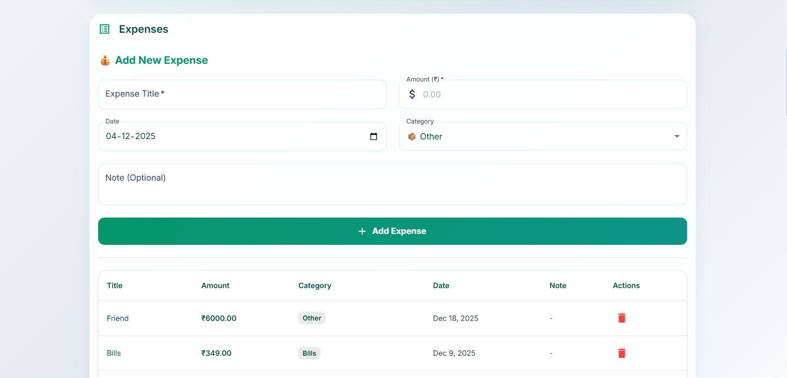
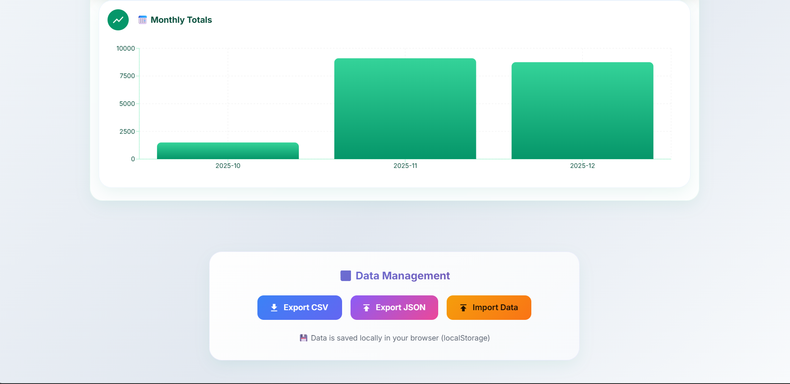
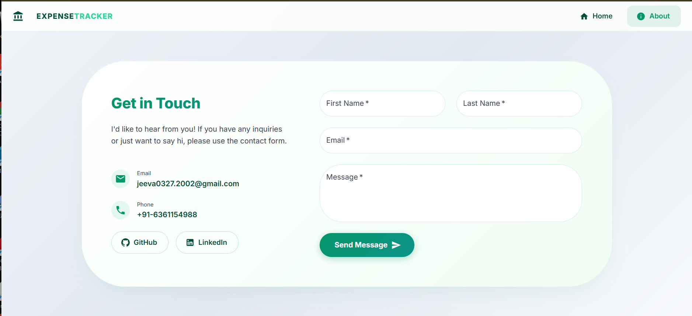

# 💰 Expense Tracker

A modern, clean, and professional expense tracking application built with **React** and **Vite**. This application helps you manage your personal finances with a beautiful "Clean Fintech" aesthetic, offering detailed analytics, budget tracking, and local data persistence.

## ✨ Features

-   **Dashboard Overview**: Get a quick snapshot of your total expenses, average daily spend, and monthly totals.
-   **Expense Management**: Easily add, edit, and delete expenses. Categorize your spending (Food, Transport, Entertainment, etc.) for better insights.
-   **Interactive Analytics**: Visualize your spending habits with dynamic charts:
    -   **Pie Chart**: Category-wise breakdown.
    -   **Line Chart**: Daily spending trends.
    -   **Bar Chart**: Monthly comparisons.
-   **Budget Tracking**: Set a monthly budget and track your usage with a visual progress bar.
-   **Local Data Persistence**: All your data is saved securely in your browser's `localStorage`. No external database required!
-   **Data Portability**:
    -   **Export**: Backup your data to JSON or CSV.
    -   **Import**: Restore your data from a backup file.
-   **Responsive Design**: Fully responsive layout that looks great on desktop, tablet, and mobile.
-   **Email Notifications**: Receive an instant email confirmation whenever a new expense is added (requires configuration).

---

## 📸 Screenshots

### 🏠 Home Dashboard

A comprehensive view of your financial health.



### ➕ Adding New Expenses

Simple and intuitive form to record your transactions.



### 📊 Analytics & Insights

Deep dive into your spending patterns.

.png)
.png)

### 💾 Data Management

Export and import your data with ease.



### ℹ️ About Page



---

## 🛠️ Tech Stack

-   **Frontend Framework**: [React](https://react.dev/)
-   **Build Tool**: [Vite](https://vitejs.dev/)
-   **Styling**:
    -   [Material-UI (MUI)](https://mui.com/) - For polished UI components.
    -   [Tailwind CSS](https://tailwindcss.com/) - For layout and utility styling.
-   **Charting**: [Recharts](https://recharts.org/) - For beautiful, responsive charts.
-   **Icons**: [MUI Icons](https://mui.com/material-ui/material-icons/)

---

## 🚀 Getting Started

Follow these steps to run the project locally on your machine.

### Prerequisites

-   **Node.js**: Make sure you have Node.js installed (v14 or higher recommended).
-   **npm**: Usually comes with Node.js.

### Installation

1.  **Clone the repository** (or download the source code):
    ```bash
    git clone <repository-url>
    cd expense-tracker
    ```

2.  **Install dependencies**:
    ```bash
    npm install
    ```

3.  **Start the development server**:
    ```bash
    npm run dev
    ```

4.  **Open your browser**:
    Navigate to `http://localhost:5173` (or the URL shown in your terminal) to view the app.

### 📧 EmailJS Configuration (Optional)

To enable email notifications for new expenses, you need to configure EmailJS.

1.  Create an account at [EmailJS](https://www.emailjs.com/).
2.  Create a **Service** and a **Template**.
3.  Create a `.env` file in the root directory.
4.  Add your EmailJS credentials:

    ```env
    VITE_EMAILJS_PUBLIC_KEY=your_public_key
    VITE_EMAILJS_SERVICE_ID=your_service_id
    VITE_EMAILJS_TEMPLATE_ID=your_template_id
    ```

---

## 📖 Usage Guide

1.  **Set Your Budget**: On the dashboard, enter your monthly budget limit in the "Monthly Budget" field.
2.  **Add Expenses**:
    -   Fill in the **Title**, **Amount**, **Category**, and **Date**.
    -   Click **Add Expense**.
    -   *Note*: If configured, you will receive an email notification with the expense details.
3.  **View History**: Scroll down to see the list of recent expenses. You can delete incorrect entries here.
4.  **Analyze**: Check the "Analytics & Insights" section to see where your money is going.
5.  **Filter Data**: Use the "View Month" dropdown to see expenses from previous months.
6.  **Backup Data**: Go to the bottom of the page to "Data Management" and click **Export JSON** to save a backup.

---

## 📝 Notes

-   **Data Storage**: This app uses `localStorage`. Clearing your browser cache will delete your data unless you have exported a backup.
-   **Currency**: The default currency is set to Indian Rupee (₹).

---
